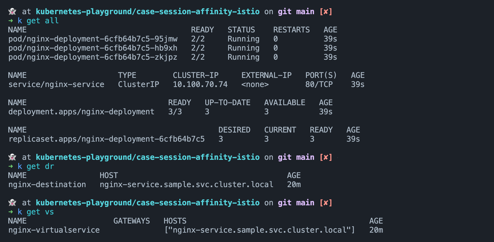

# Session Affinity with Istio

This case I used to demonstrate how to use Istio for session affinity in Kubernetes, which is a common
requirement for many applications, especially for those that are stateful.

## Prerequisites

1. Kubernetes cluster(recommended to use minikube for local development)
2. Istio installed in the cluster, refer to [Istio Installation with Helm](#istio-installation-with-helm)

## Deploying the Sample Service

Create the namespace and deploy the sample service:

```fish
kubectl create ns sample
kubectl label namespace sample istio-injection=enabled  # enable istio sidecar injection

kubectl apply -f nginx-deployment.yaml -n sample
kubectl apply -f nginx-service.yaml -n sample

kubectl apply -f nginx-destinationrule.yaml -n sample
kubectl apply -f nginx-virtualservice.yaml -n sample
```



## Testing the Session Affinity

Before we start testing, let's open another terminal and watch the logs of the nginx pods:

```fish
kubectl logs -f <pod>
```

Create a test pod and exec into it:

```fish
kubectl apply -f test-pod.yaml -n sample
kubectl exec -it test-pod -n sample -- /bin/sh
```

Now, let's test the session affinity:

```fish
curl -H "user-session: sid-1" http://nginx-service
```

We can see that the request with the same value of the `user-session` header is routed to the same pod.

## Istio Installation with Helm

```fish
helm repo add istio https://istio-release.storage.googleapis.com/charts
helm repo update
helm install istio-base istio/base -n istio-system --set defaultRevision=default --create-namespace
helm install istiod istio/istiod -n istio-system --wait

kubectl get pods -n istio-system # check if all pods are running
```

## See Also

- [DestinationRule](https://istio.io/latest/docs/reference/config/networking/destination-rule/)
- [VirtualService](https://istio.io/latest/docs/reference/config/networking/virtual-service/)
- [Consistent hashing based on httpHeader works through ingress-gateway but not through service #12178](https://github.com/istio/istio/issues/12178#issuecomment-473248420)
